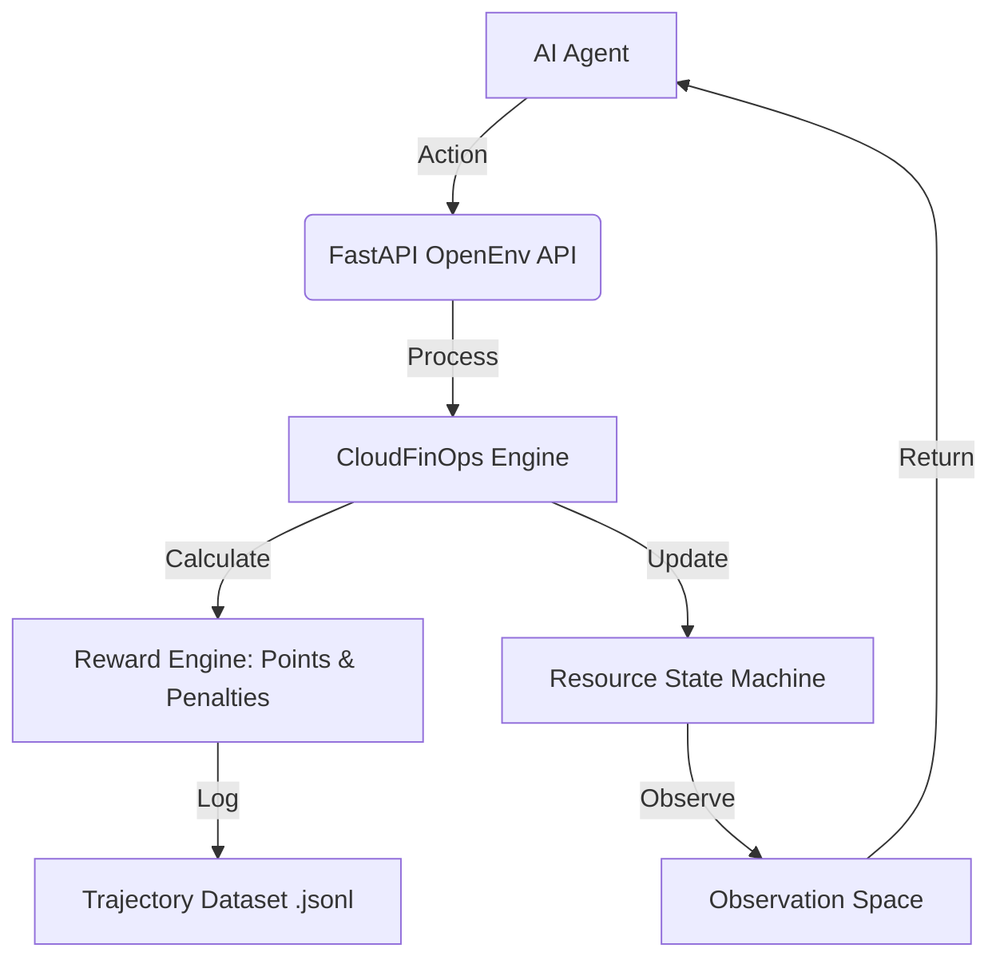

# 💰 CloudFinOps-Env: Data-Driven Infrastructure Optimizer

**CloudFinOps-Env** is a real-world Reinforcement Learning environment designed for the **Meta/Hugging Face OpenEnv Hackathon**. It turns an AI agent into a Cloud FinOps Engineer tasked with optimizing AWS-style infrastructure costs while maintaining strict performance SLAs.

## 🚀 Environment Overview

The environment simulates a dynamic cloud footprint where resources (Instances, Storage, S3) generate costs and utilization metrics. The agent must make real-time decisions to reduce the "Cloud Bill" without causing production outages.

### 🎯 Key Features
- **RL Feedback Loop**: Granular "Points and Penalties" (Reward Shaping) system.
- **Data-Centric**: Automatic **Trajectory Logging** (JSONL) for offline RL training and SFT.
- **Real-World Snapshots**: Ability to ingest infrastructure JSON exports into the simulation.
- **OpenEnv Compliant**: Fully implements the `step()`, `reset()`, and `state()` API.

---

## 🏗️ Architecture



---

## 📊 Scoreboard: Points & Penalties

The reward function $R$ is explicitly designed to teach efficiency vs. risk:

| Type | Action | Value | Description |
| :--- | :--- | :--- | :--- |
| ⭐ **Point** | **Cost Savings** | `+10.0` (max) | Scaled based on the percentage of hourly savings achieved. |
| ⭐ **Point** | **Cleanup** | `+0.50` | Bonus for removing abandoned/orphaned resources. |
| ❌ **Penalty** | **SLA Breach** | `-5.00` | Applied every step a resource's CPU usage exceeds **90%**. |
| ❌ **Penalty** | **Aggressive Term** | `-1.00` | Penalty for deleting production-critical resources. |

---

## 🛠️ Usage & Integration

### Installation
```bash
pip install -r requirements.txt
```

### Running Locally
```bash
uvicorn app:app --host 0.0.0.0 --port 7860
```

### Baseline Agent
The environment includes a ReAct-based agent (`inference.py`) that demonstrates zero-shot optimization using GPT-4o.

```bash
export OPENAI_API_KEY="your-key"
python inference.py
```

---

## 📂 Dataset Collection
Every step taken by an agent is recorded in `data/trajectories/`. These files follow the Hugging Face dataset format:
```json
{"episode_id": "ep_123", "step": 5, "observation": {...}, "action": {...}, "reward": 8.5}
```

---

## 📜 Metadata
- **Domain**: Cloud Infrastructure / FinOps
- **Difficulty**: Easy to Hard (3 Scenarios)
- **Framework**: FastAPI / Pydantic / Docker
- **License**: MIT
