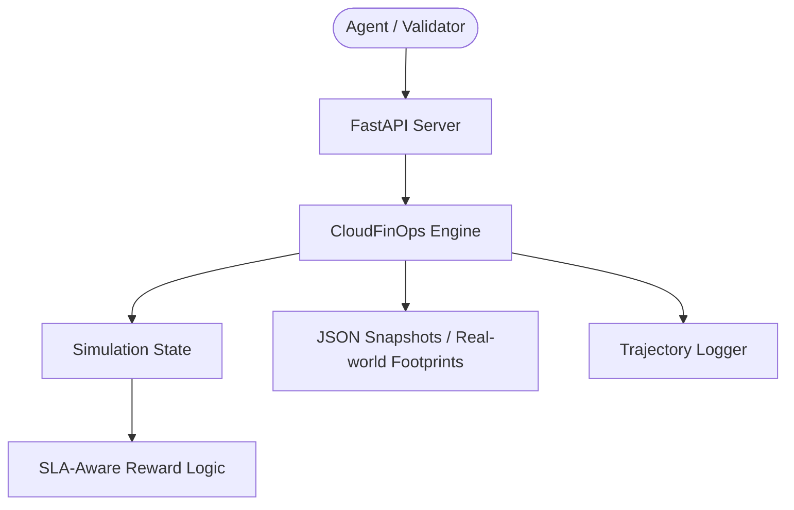

# ☁️ CloudFinOps-Env: Data-Driven Cost Optimization

[](https://github.com/openenv-hackathon)
[](https://opensource.org/licenses/MIT)

**CloudFinOps-Env** is a high-fidelity simulator designed for training Reinforcement Learning (RL) agents to optimize cloud infrastructure costs while strictly maintaining performance Service Level Agreements (SLAs).

## 🚀 Why This Matters
Cloud waste accounts for billions of dollars annually. Traditional rule-based scaling often fails in complex multi-resource environments. CloudFinOps-Env provides a safe sandbox for agents to learn the delicate balance between **Cost Efficiency** and **Performance Reliability**.

## 🏗️ Advanced Architecture
The environment follows the **OpenEnv standardized "Multi-Mode" structure**, ensuring complete compatibility with automated evaluation runners.



## 🌟 Innovation Highlights
-   **Snapshot Ingestion Engine**: Dynamically load real-world infrastructure footprints (VMs, EBS, S3) from JSON snapshots.
-   **SLA-Aware Reward Function**: Penalties are heavily weighted toward CPU load breaches (>90%), forcing agents to prioritize stability over "blind" cost cutting.
-   **Granular Action Space**: Support for `terminate`, `resize` (with performance recalibration), and `cleanup_orphaned` operations.
-   **Automatic Trajectory Logging**: Every interaction is logged into `.jsonl` files, building a dataset for future offline RL training.

## 📊 Reward Engineering
Our reward function is designed using a multi-component scoring system:
$$ Reward = (Points_{savings} \times 10) + Bonus_{efficiency} - (Penalty_{SLA} \times 5) - Penalty_{risk} $$

-   **Savings**: Normalized percentage of cost reduction.
-   **SLA Penalty**: Triggered when any active instance exceeds 90% CPU load after a resize or resource shuffle.

## 🛠️ Getting Started
### Deployment
Project is production-ready for Hugging Face Spaces.
```bash
# Install dependencies
pip install -r requirements.txt

# Run server
uvicorn server.app:app --host 0.0.0.0 --port 7860
```

### Testing the Agent
Run the baseline ReAct agent to see the environment in action:
```bash
python inference.py
```

## 🗺️ Roadmap
- [ ] **Multi-Cloud Support**: Expand metadata to support GCP and Azure pricing models.
- [ ] **Dependency Modeling**: Introduce "Dependency Graphs" where terminating a DB resource affects the health of connected App resources.
- [ ] **Grafana Dashboard**: Real-time visualization of agent performance and cost trajectories.

---
Developed for the **OpenEnv Scaller Hackathon** by **spiderqwerty12**.
